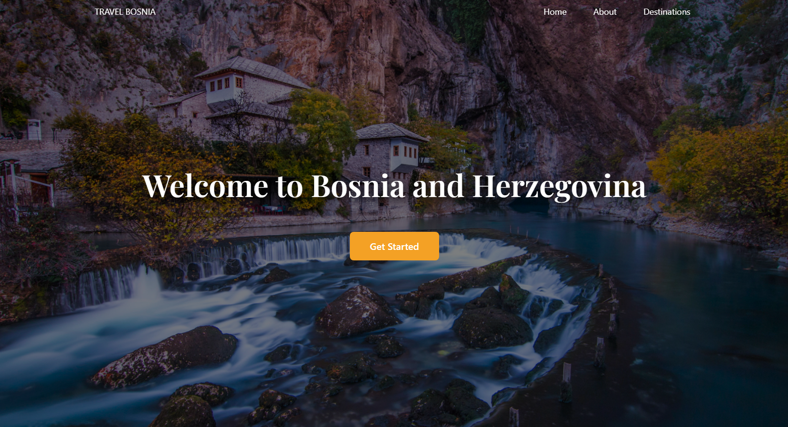
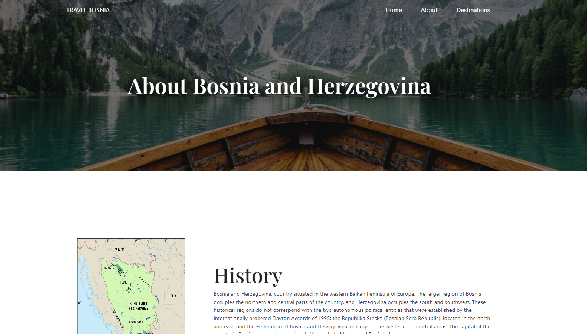
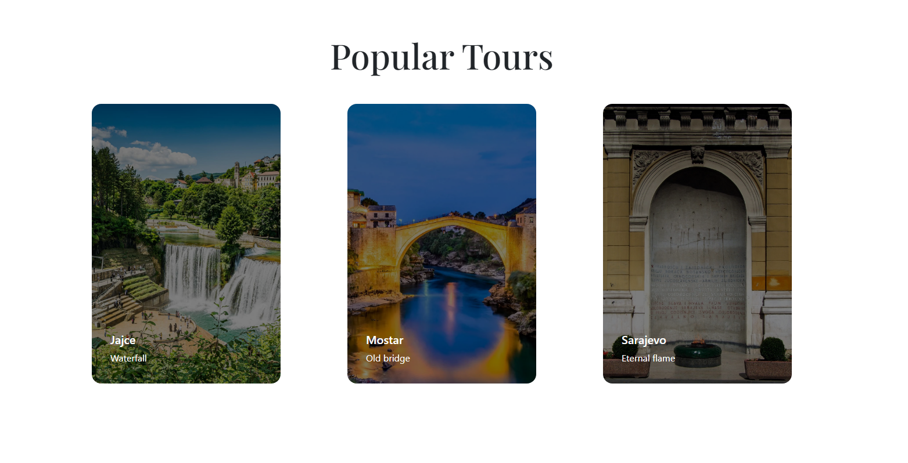
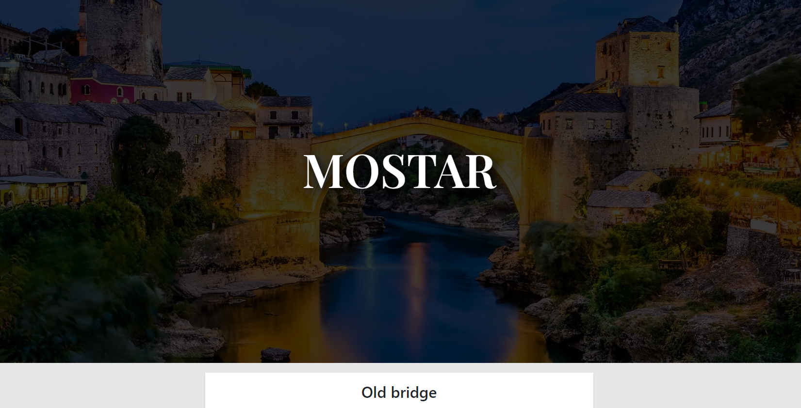

# Bosnia Travel

React travel website focused on Bosnia and Herzegovina. It provides information about the country's history and popular destinations. The main sections of the app include an "About" section and a section displaying all the tours available.

# About section

In the "About" section, users can explore the rich history and cultural heritage of Bosnia and Herzegovina. It provides an overview of the country's historical significance, including key events, landmarks, and traditions. The section aims to give users a deeper understanding of the destination and its cultural context.

# Popular tours

The tours are displayed using cards in the main section of the app. Each card represents a specific tour and includes relevant information such as the tour title, description, and an accompanying image. Users can browse through the available tours and get a glimpse of what each tour offers.

# Details page

When a user clicks on a tour card, they are redirected to a dedicated detail page for that tour. The detail page provides comprehensive information about the selected tour, including additional details, itinerary, pricing, and any other relevant information. This page allows users to make an informed decision about booking the tour.

